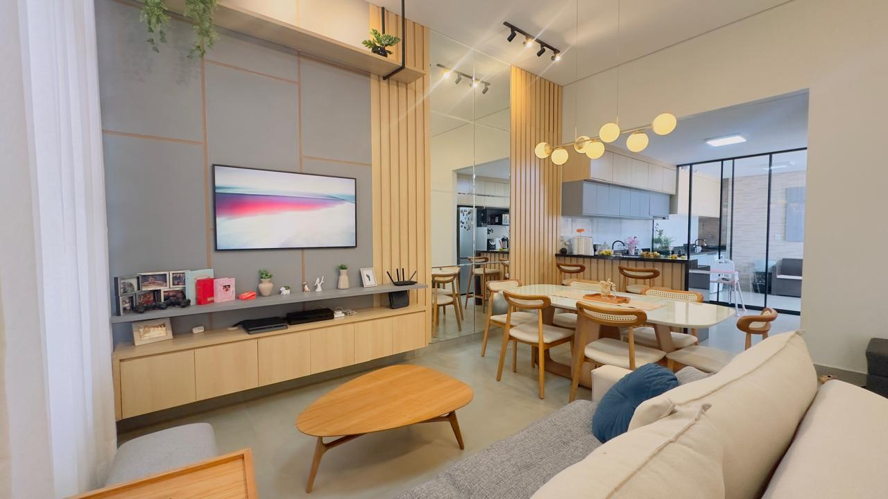

# 🏡 Casa QD 101 · Recanto das Emas — LP

Landing page de alta conversão para a imobiliária **Sara Araújo · CRECI/DF 27053**, anunciando uma casa nova na QD 101 do Recanto das Emas — DF.

**Stack:** HTML + CSS + JS puro · sem build · sem framework · carrega em ~0.3s.

---

## 📁 Estrutura

```
casa-qd101-recanto-emas/
├── index.html                ← LP principal
├── politica-privacidade.html ← LGPD (exigido pelo Meta)
├── css/
│   └── styles.css            ← paleta + Fraunces + Inter + responsivo
├── js/
│   ├── main.js               ← CONFIG WhatsApp, UTMs, lightbox, reveals
│   └── meta-pixel.js         ← Pixel Meta (placeholder)
├── img/                      ← coloque aqui as fotos (vazio por enquanto)
└── README.md
```

---

## ✅ Checklist — O que substituir quando os assets chegarem

### 📞 1. Número do WhatsApp da Sara
**Arquivo:** `js/main.js`
**Linha:** ~10
```js
whatsappNumber: '55619XXXXXXXX',  // ← substituir por DDD+número real
```

### 🎨 2. ID do Meta Pixel
**Arquivo:** `js/meta-pixel.js`
**Linha:** ~7
```js
var PIXEL_ID = 'SEU_PIXEL_ID_AQUI';  // ← substituir pelo ID real do pixel
```

### 📸 3. Fotos da capa da hero (cross-fade com Ken Burns) — Até 5 fotos
A hero atual tem um cross-fade com Ken Burns entre até 5 fotos em loop infinito (cada uma fica visível ~6s com zoom lento, depois dissolve para a próxima).

**Pasta:** `img/`
- `hero-01.jpg` ← primeira
- `hero-02.jpg`
- `hero-03.jpg`
- `hero-04.jpg`
- `hero-05.jpg` ← última

**Basta substituir esses 5 arquivos pelas fotos reais** (podem ser JPG ou PNG — JPG recomendado pra performance).

**Para menos de 5 fotos:** duplique a primeira foto nos arquivos seguintes. O cross-fade vai mostrar a mesma foto em todas as posições.

**Para mais de 5 fotos:** edite `css/styles.css` na regra `.hero__slide:nth-child(N)` e adicione `:nth-child(6) { animation-delay: 30s; }` etc. Também adicione `<div class="hero__slide"></div>` no HTML. Não recomendo mais que 7-8 fotos.

**Dimensões recomendadas:** 1920×1080 (Full HD, 16:9) ou maior. O `background-size: cover` cuida do ajuste.

### 🖼️ 4. Galeria de fotos (7 imagens)
**Arquivo:** `index.html`
**Local:** `.gallery__grid` (procure `Foto 01 — Sala de estar`)
```html
<!-- Em cada botão .gallery__item, descomentar o  e apagar a <div class="gallery__placeholder"> -->

```
- Arquivos esperados: `foto-01.jpg` até `foto-07.jpg`
- Os comentários HTML em cada item mostram o `data-caption` correspondente

### 🗺️ 5. Mapa (Google Maps embed)
**Arquivo:** `index.html`
**Local:** dentro de `.location__map` (procure `SUBSTITUIR: embed do Google Maps`)
```html
<!-- Como pegar o embed: -->
<!-- 1. Abra Google Maps → busque "QD 101, Recanto das Emas, Brasília" -->
<!-- 2. Clique em Compartilhar → Incorporar um mapa → Copiar HTML -->
<!-- 3. Cole o <iframe> no lugar do comentário -->
<iframe src="https://www.google.com/maps/embed?pb=..." loading="lazy"></iframe>
```

### 👤 6. Foto da Sara
**Arquivo:** `index.html`
**Local:** dentro de `.about__photo` (procure `Foto · Sara Araújo`)
```html

```

### 🖼️ 7. Open Graph (preview ao compartilhar no WhatsApp/Instagram)
**Arquivo:** `index.html`
**Linha:** ~17
```html
<meta property="og:image" content="./img/og-cover.jpg" />
<!-- Criar imagem 1200x630px com a foto principal + logo Sara -->
```

---

## 🎨 Paleta

| Token | Hex | Uso |
|---|---|---|
| `--bg-cream` | `#F4EFE3` | Fundo principal |
| `--bg-cream-2` | `#ECE5D2` | Variação de fundo |
| `--bg-blue` | `#0B1F33` | Sessões escuras (stats + CTA final) |
| `--gold` | `#B8923A` | Accent principal |
| `--gold-light` | `#D9BC73` | Dourado champagne (stats) |
| `--gold-deep` | `#7A5E22` | Hover / itálico |
| `--ink` | `#1A1A1A` | Texto principal |
| `--hairline` | `#D4C99B` | Linhas finas douradas |

**Tipografia:**
- **Fraunces** (títulos) — serif moderna com optical size
- **Inter** (corpo) — sans geométrica

---

## 📊 Eventos do Meta Pixel

| Evento | Quando dispara | Otimização |
|---|---|---|
| `PageView` | Carregamento da página | Baseline |
| `Lead` | Clique em qualquer botão WhatsApp | **Conversão principal** |

Cada botão WhatsApp tem `data-cta-source` único que vai como parâmetro do evento:
- `header` · `hero-principal` · `sobre-sara` · `bloco-preco` · `cta-final` · `flutuante` · `footer`

---

## 💬 Mensagem WhatsApp (pré-preenchida)

Quando alguém clica, a mensagem já chega assim:

```
Olá Sara, vi o anúncio da casa da QD 101 no Recanto das Emas.
Pode me passar mais informações?

Origem: facebook / paid_social (campanha: casa-recanto-emas-julho)
[CTA: hero-principal]
```

A Sara vai saber exatamente de qual seção o lead veio e qual campanha trouxe.

---

## 🚀 Deploy (Vercel)

```bash
# 1. Subir pro GitHub
git init
git add .
git commit -m "feat: LP Casa QD 101 Recanto das Emas"
gh repo create casa-qd101-recanto-emas --public --source=. --push

# 2. Vercel auto-deploya no push (se já tem projeto linkado)
vercel --prod   # ← avisar antes de subir
```

---

## 🛡️ LGPD

Política de Privacidade em `politica-privacidade.html` — linkada no footer.
**Obrigatória** para usar Meta Pixel (regra do Meta).

---

## 📝 Customizações rápidas

- **Trocar paleta:** edite as variáveis em `css/styles.css` linhas 7-25
- **Trocar fontes:** edite o `<link>` do Google Fonts no `<head>` de `index.html` e as vars `--font-serif`/`--font-sans` no CSS
- **Adicionar vídeo:** criar nova seção após a galeria e colar iframe do YouTube com `loading="lazy"`

---

**Feito por BaseCode Digital · 2026**
